# Mermaid 语法指南

## 目录
- [简介](#简介)
- [流程图 (Flowchart)](#流程图-flowchart)
- [时序图 (Sequence Diagram)](#时序图-sequence-diagram)
- [类图 (Class Diagram)](#类图-class-diagram)
- [状态图 (State Diagram)](#状态图-state-diagram)
- [甘特图 (Gantt Chart)](#甘特图-gantt-chart)
- [饼图 (Pie Chart)](#饼图-pie-chart)
- [Git图 (Git Graph)](#git图-git-graph)
- [ER图 (Entity Relationship)](#er图-entity-relationship)
- [高级技巧](#高级技巧)

---

## 简介

Mermaid 是一种基于文本的图表生成工具，允许你使用简单的文本描述来创建各种图表。它可以在 Markdown 文件、网页和文档中使用。

### 基本用法

在 Markdown 中使用 Mermaid：

~~~markdown
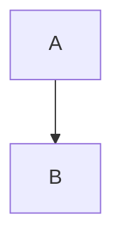
~~~

---

## 流程图 (Flowchart)

### 图表方向


**可用方向：**
- `TB` 或 `TD` - Top to Bottom（从上到下）
- `BT` - Bottom to Top（从下到上）
- `LR` - Left to Right（从左到右）
- `RL` - Right to Left（从右到左）

### 节点形状

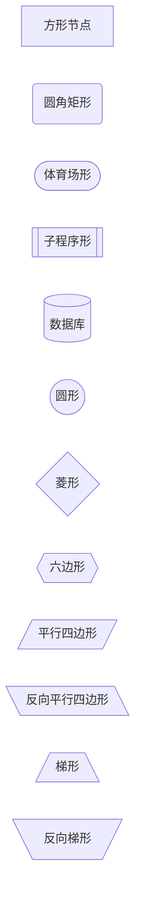

**节点语法：**
- `[文本]` - 矩形
- `(文本)` - 圆角矩形
- `([文本])` - 体育场形
- `[[文本]]` - 子程序形
- `[(文本)]` - 圆柱形（数据库）
- `((文本))` - 圆形
- `{文本}` - 菱形
- `{{文本}}` - 六边形
- `[/文本/]` - 平行四边形
- `[\文本\]` - 反向平行四边形
- `[/文本\]` - 梯形
- `[\文本/]` - 反向梯形

### 连接线类型

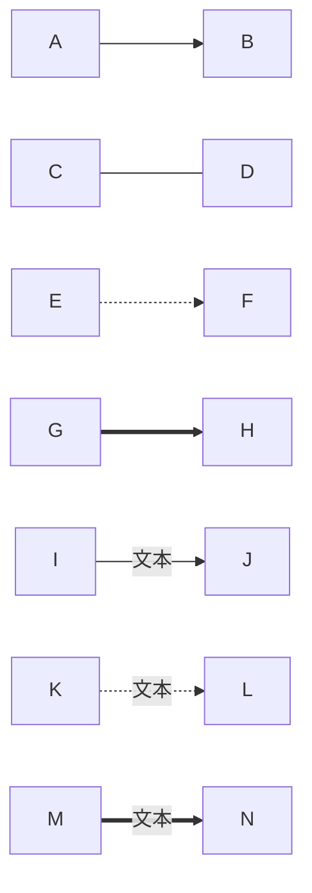

**连接线语法：**
- `-->` - 实线箭头
- `---` - 实线
- `-.->` - 虚线箭头
- `-.-` - 虚线
- `==>` - 粗实线箭头
- `===` - 粗实线
- `-- 文本 -->` - 带文本的箭头

### 完整示例

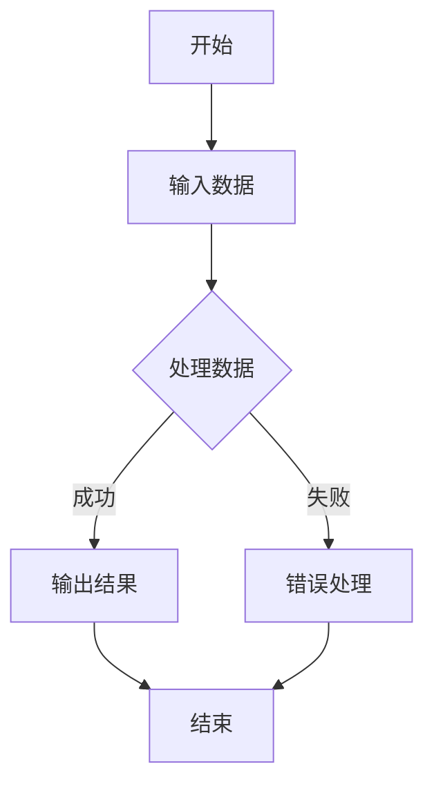

---

## 时序图 (Sequence Diagram)

### 基本语法

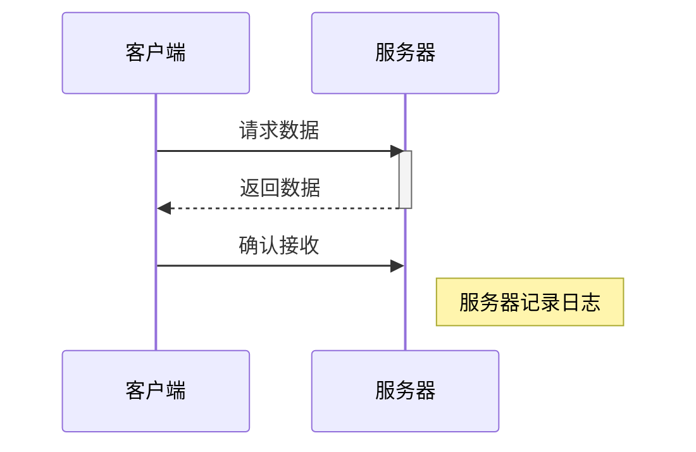

### 参与者定义

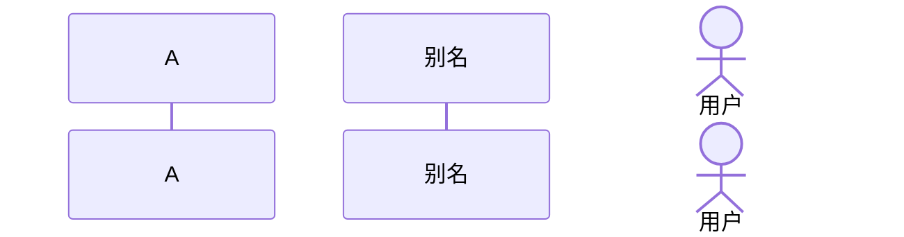

### 消息类型

**箭头类型：**
- `->>` - 实线箭头
- `-->>` - 虚线箭头
- `->>+` - 实线箭头并激活
- `-->>-` - 虚线箭头并停用
- `-x` - 末端为 X 的实线
- `--x` - 末端为 X 的虚线
- `-)` - 异步箭头
- `--)` - 异步虚线箭头

### 激活与停用

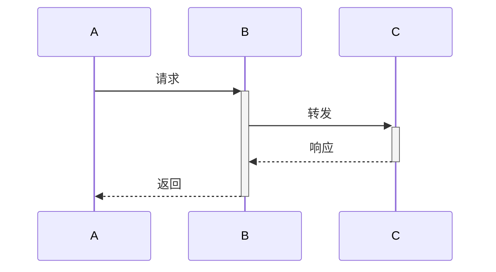

### 注释

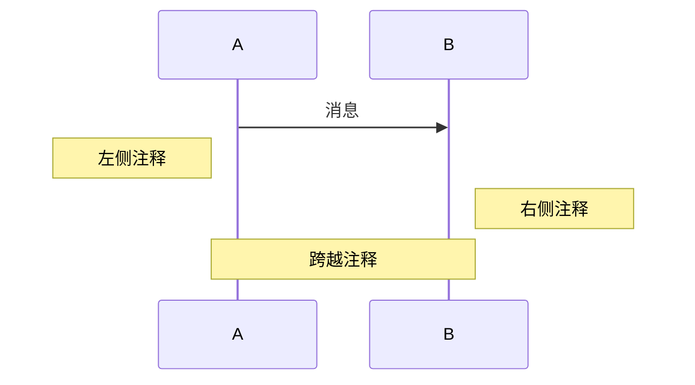

### 循环与条件

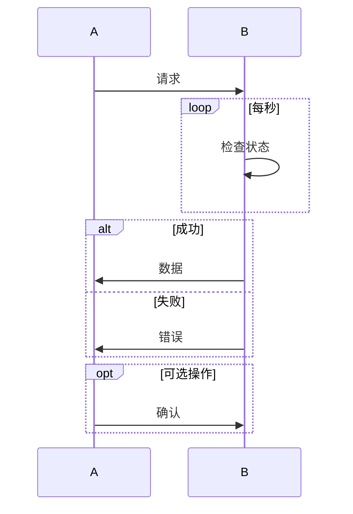

---

## 类图 (Class Diagram)

### 基本语法

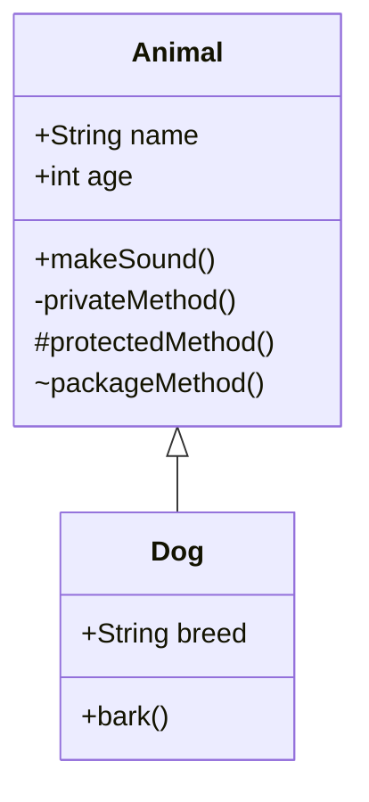

### 可见性修饰符

- `+` - public（公有）
- `-` - private（私有）
- `#` - protected（受保护）
- `~` - package/internal（包内）

### 关系类型

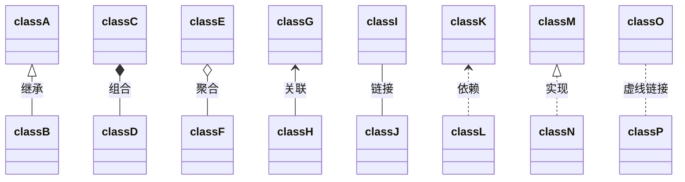

**关系符号：**
- `<|--` - 继承
- `*--` - 组合
- `o--` - 聚合
- `-->` - 关联
- `--` - 链接
- `..>` - 依赖
- `<|..` - 实现
- `..` - 虚线链接

### 多重性

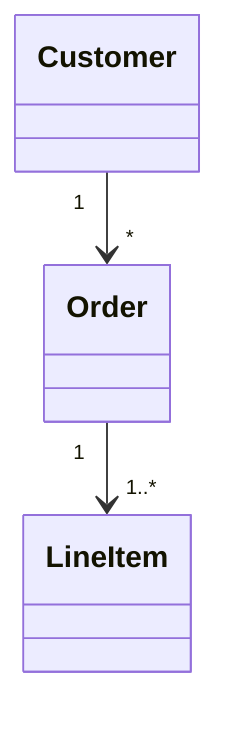

### 注解

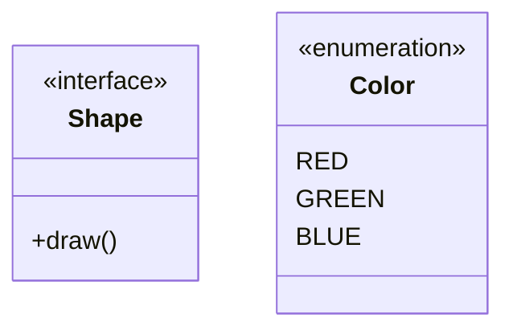

---

## 状态图 (State Diagram)

### 基本语法

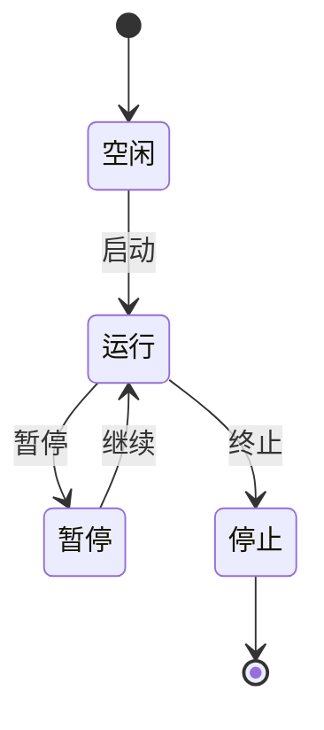

### 复合状态

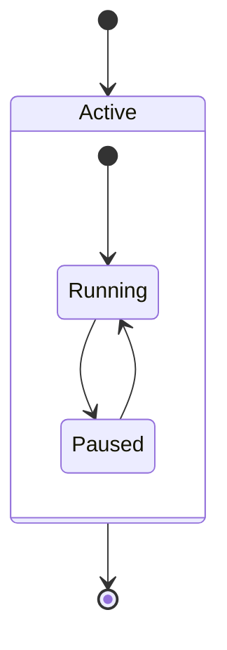

### 并发状态

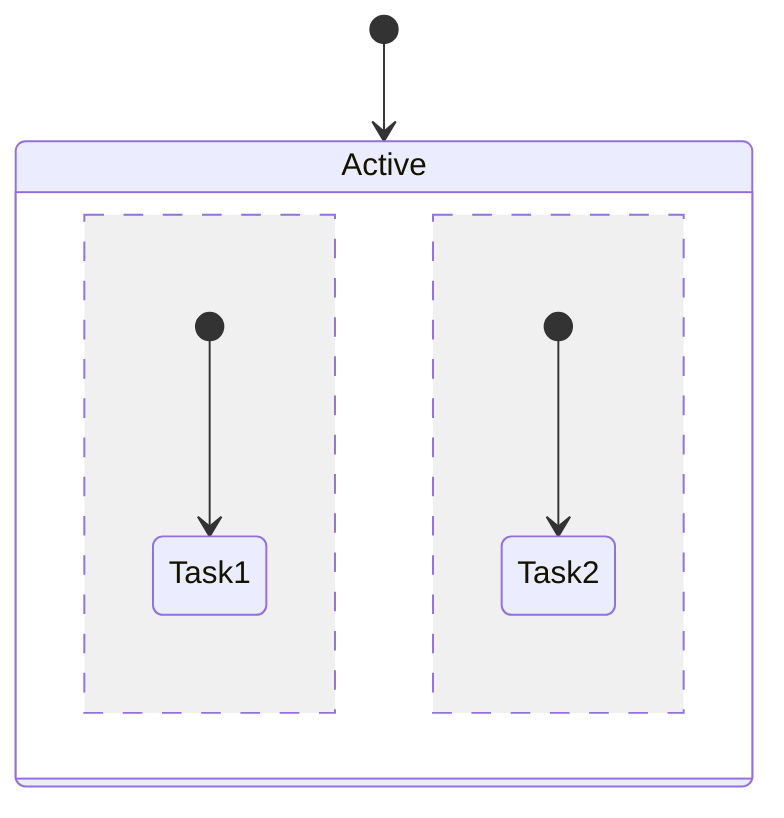

### 注释

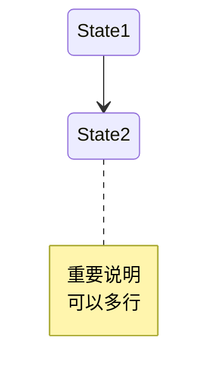

---

## 甘特图 (Gantt Chart)

### 基本语法

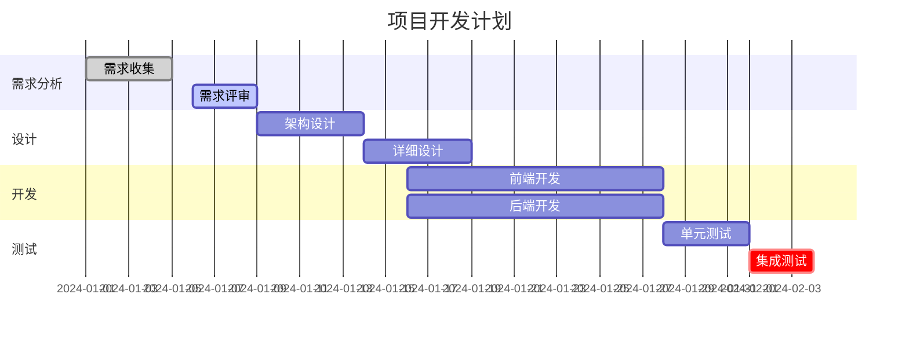

### 状态标记

- `done` - 已完成
- `active` - 进行中
- `crit` - 关键路径
- 默认 - 待开始

### 时间格式

- `YYYY-MM-DD` - 年-月-日
- `after 任务ID` - 在某任务之后
- `3d` - 持续3天
- `1w` - 持续1周

---

## 饼图 (Pie Chart)

### 基本语法

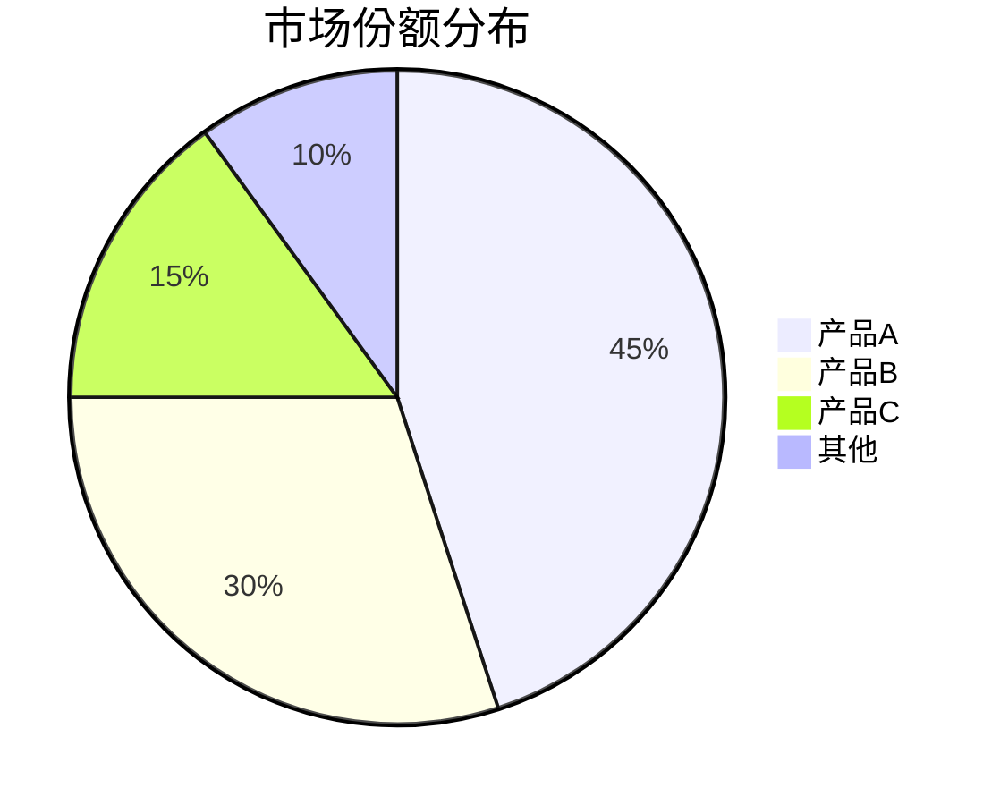

### 显示百分比

```mermaid
pie showData
    title 用户偏好
    "iOS" : 386
    "Android" : 500
    "Web" : 114
```

---

## Git图 (Git Graph)

### 基本语法

```mermaid
gitGraph
    commit
    commit
    branch develop
    checkout develop
    commit
    commit
    checkout main
    merge develop
    commit
```

### 带标签

```mermaid
gitGraph
    commit id: "初始化"
    commit id: "添加功能A"
    branch feature
    checkout feature
    commit id: "开发功能B"
    checkout main
    commit id: "修复bug"
    merge feature tag: "v1.0"
```

---

## ER图 (Entity Relationship)

### 基本语法

```mermaid
erDiagram
    CUSTOMER ||--o{ ORDER : places
    ORDER ||--|{ LINE-ITEM : contains
    CUSTOMER }|..|{ DELIVERY-ADDRESS : uses
```

### 关系符号

**基数：**
- `||` - 正好一个
- `o|` - 零个或一个
- `}|` - 一个或多个
- `}o` - 零个或多个

**关系线：**
- `--` - 实线
- `..` - 虚线

### 属性定义

```mermaid
erDiagram
    CUSTOMER {
        string name
        string custNumber PK
        string sector
    }
    ORDER {
        int orderNumber PK
        string deliveryAddress
        date orderDate
    }
    CUSTOMER ||--o{ ORDER : places
```

**属性修饰符：**
- `PK` - Primary Key（主键）
- `FK` - Foreign Key（外键）
- `UK` - Unique Key（唯一键）

---

## 高级技巧

### 1. 样式定制

```mermaid
graph LR
    A[节点A]:::classA --> B[节点B]:::classB

    classDef classA fill:#f9f,stroke:#333,stroke-width:4px
    classDef classB fill:#bbf,stroke:#333,stroke-width:2px,color:#fff
```

### 2. 子图

```mermaid
graph TB
    subgraph 前端
        A[React]
        B[Vue]
    end

    subgraph 后端
        C[Node.js]
        D[Python]
    end

    A --> C
    B --> D
```

### 3. 链式连接

```mermaid
graph LR
    A --> B --> C --> D
    E --> F & G --> H
```

### 4. 注释

```mermaid
graph TD
    A --> B
    %% 这是单行注释
    B --> C
```

### 5. 转义字符

在节点文本中使用特殊字符：

```mermaid
graph LR
    A["使用 #quot;引号#quot;"]
    B["使用 #nbsp; 空格"]
    C["使用 <br/> 换行"]
```

### 6. 点击事件和链接

```mermaid
graph LR
    A[点击访问]
    click A "https://mermaid.js.org" "访问官网"
```

---

## 最佳实践

1. **保持简洁**：避免在一个图表中放入过多元素
2. **使用有意义的ID**：给节点使用描述性的标识符
3. **合理分组**：使用子图组织相关元素
4. **添加注释**：在复杂图表中添加说明
5. **一致的命名**：保持节点命名风格统一
6. **版本控制**：将图表定义存储在代码仓库中

---

## 参考资源

- [Mermaid 官方文档](https://mermaid.js.org/)
- [Mermaid Live Editor](https://mermaid.live/) - 在线编辑器
- [GitHub Mermaid 支持](https://github.blog/2022-02-14-include-diagrams-markdown-files-mermaid/)

---

**创建日期：** 2025-12-20
**版本：** 1.0
